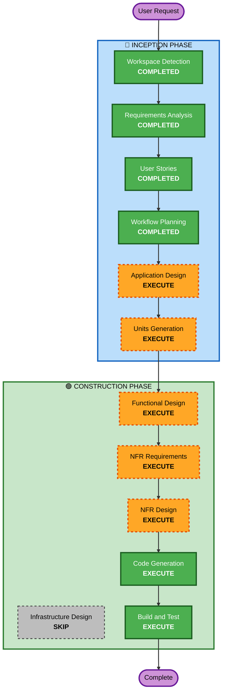

# Execution Plan

## Detailed Analysis Summary

### Change Impact Assessment
- **User-facing changes**: Yes - 고객용 주문 앱 + 관리자 앱 전체 신규 구축
- **Structural changes**: Yes - 전체 시스템 아키텍처 신규 설계
- **Data model changes**: Yes - 매장, 룸, 메뉴, 주문, 합석, 메시지, 미니게임 등 다수 엔티티
- **API changes**: Yes - REST API 전체 신규 설계 + SSE 엔드포인트
- **NFR impact**: Yes - 실시간 통신(SSE), JWT 인증, 파일 업로드, 세션 관리

### Risk Assessment
- **Risk Level**: Medium
- **Rollback Complexity**: Easy (Greenfield - 기존 시스템 없음)
- **Testing Complexity**: Complex (실시간 통신, 합석 플로우, 미니게임)

## Workflow Visualization



### Text Alternative
```
Phase 1: INCEPTION
- Workspace Detection (COMPLETED)
- Requirements Analysis (COMPLETED)
- User Stories (COMPLETED)
- Workflow Planning (COMPLETED)
- Application Design (EXECUTE)
- Units Generation (EXECUTE)

Phase 2: CONSTRUCTION (per-unit)
- Functional Design (EXECUTE)
- NFR Requirements (EXECUTE)
- NFR Design (EXECUTE)
- Infrastructure Design (SKIP)
- Code Generation (EXECUTE)
- Build and Test (EXECUTE)
```

## Phases to Execute

### 🔵 INCEPTION PHASE
- [x] Workspace Detection (COMPLETED)
- [x] Requirements Analysis (COMPLETED)
- [x] User Stories (COMPLETED)
- [x] Workflow Planning (COMPLETED)
- [ ] Application Design - EXECUTE
  - **Rationale**: 신규 프로젝트로 컴포넌트 식별, 서비스 레이어 설계, 컴포넌트 간 의존성 정의 필요
- [ ] Units Generation - EXECUTE
  - **Rationale**: 복잡한 시스템(주문+소셜+미니게임)으로 다수 유닛 분해 필요

### 🟢 CONSTRUCTION PHASE (per-unit)
- [ ] Functional Design - EXECUTE
  - **Rationale**: 데이터 모델, 비즈니스 로직(합석 규칙, 연장 규칙 등) 상세 설계 필요
- [ ] NFR Requirements - EXECUTE
  - **Rationale**: SSE 실시간 통신, JWT 인증, 파일 업로드 등 NFR 요구사항 존재
- [ ] NFR Design - EXECUTE
  - **Rationale**: NFR 패턴(인증, 실시간 통신, 파일 처리) 설계 필요
- [ ] Infrastructure Design - SKIP
  - **Rationale**: 로컬 서버/On-premises 배포로 클라우드 인프라 설계 불필요. Docker Compose로 로컬 실행 환경만 구성
- [ ] Code Generation - EXECUTE (ALWAYS)
  - **Rationale**: 코드 구현 필수
- [ ] Build and Test - EXECUTE (ALWAYS)
  - **Rationale**: 빌드 및 테스트 지침 필수

## Success Criteria
- **Primary Goal**: 룸 헌팅포차 전문 테이블오더 서비스 MVP 완성
- **Key Deliverables**: Spring Boot 백엔드 API, React 고객용 앱, React 관리자용 앱, MySQL 스키마
- **Quality Gates**: 전체 유닛 테스트 통과, API 동작 확인, SSE 실시간 통신 동작
